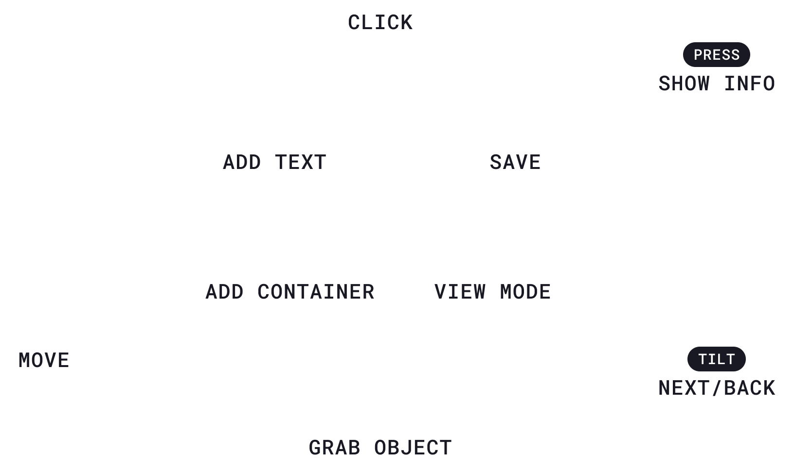

# Holo Presentation

**This is a just for fun experiment. It's not stable nor actively maintained. I'd still love to get your feedback!**

A prototype to test out presentations native to 3D environments. 

## Getting Started

Visit [https://holo-presentation.vercel.app/](https://holo-presentation.vercel.app/).

You'll be greeted by an onboarding panel. To show/hide, press `i` on the keyboard or right thumbstick on the VR controller. In the onboarding panel there are a couple pre-made examples. 

## Controls

1. Create a container for the presentation by pressing `c` on the keyboard or `x` on the left VR controller.
    1. The container has an add button that adds depth containers to organize information spatially.
2. Drag and drop images and GLTF models into the window (only on desktop) to load the assets in the container
3. Open a text input by pressing `t` on the keyboard or `y` on the left VR controller.
    1. On desktop, you can type a single emoji. This loads a 3D version of that emoji.
4. Click on a loaded assets to view tools: remove, resize, move, and scale.
5. Click `v` on the keyboard or `a` on the right VR controller to enter View mode. This centers the current object into view.
    1. Use right/left arrows on the keyboard or move the joystick on the right controller to center the next/previous object in the presentation.

### Keyboard

### VR

In VR, instead of the tool sidebar, you can manipulate objects by pressing the grip button and moving the controller. If you press the grip button on both controllers, you can scale the object.

## Running locally

1. `npm i`
2. `npm run dev`
3. Open [http://localhost:3000](http://localhost:3000)